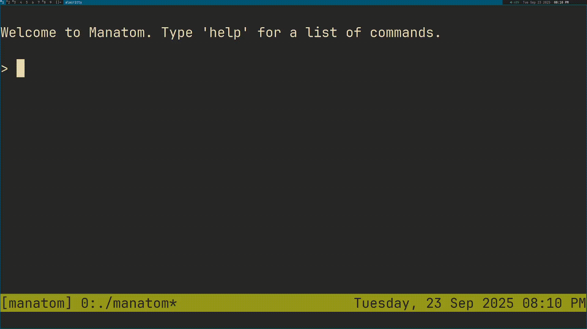

# ⚛️ Manatom
A game about managing your atoms.



## 🎮 Gameplay
Manatom runs entirely in the shell. Type 'help' for information on commands.
Commands follow the usual format of text adventure games, of `command
[object]`, with some variation.

The story of the game is about a ruined birthday party because the birthday boy
is thirsty. So, you have to use some clever chemistry tricks to make water for
him.

## 🔧 Building and Development
Manatom is written entirely in C with no external libraries.

To build and run the game:
```sh
git clone https://github.com/kolin63/manatom
cd manatom
make
chmod +x manatom # for linux or macos users
./manatom
```
